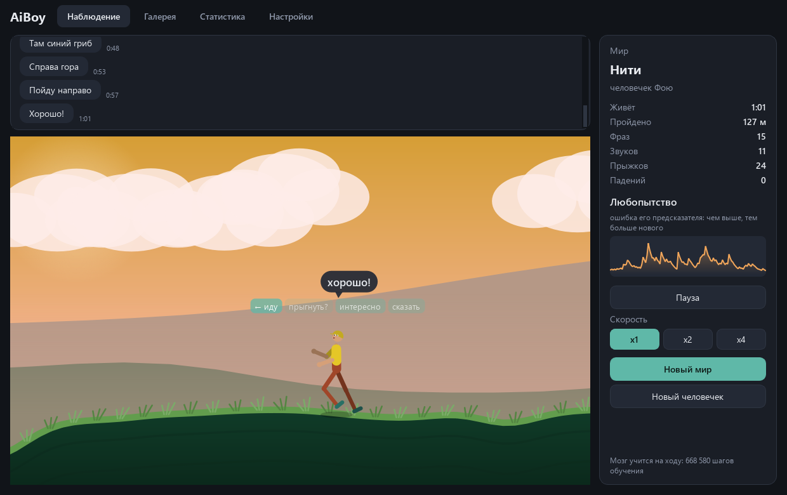
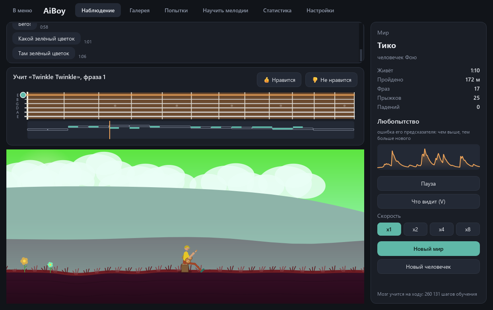
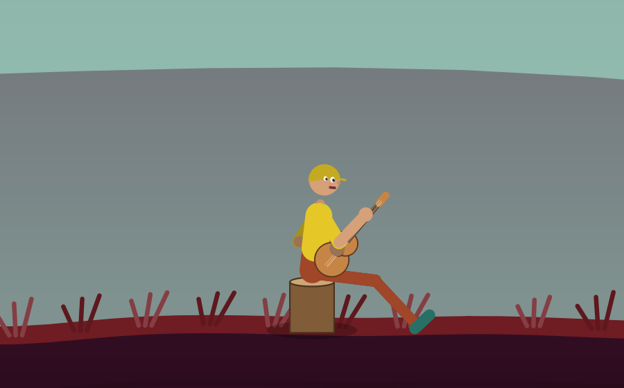
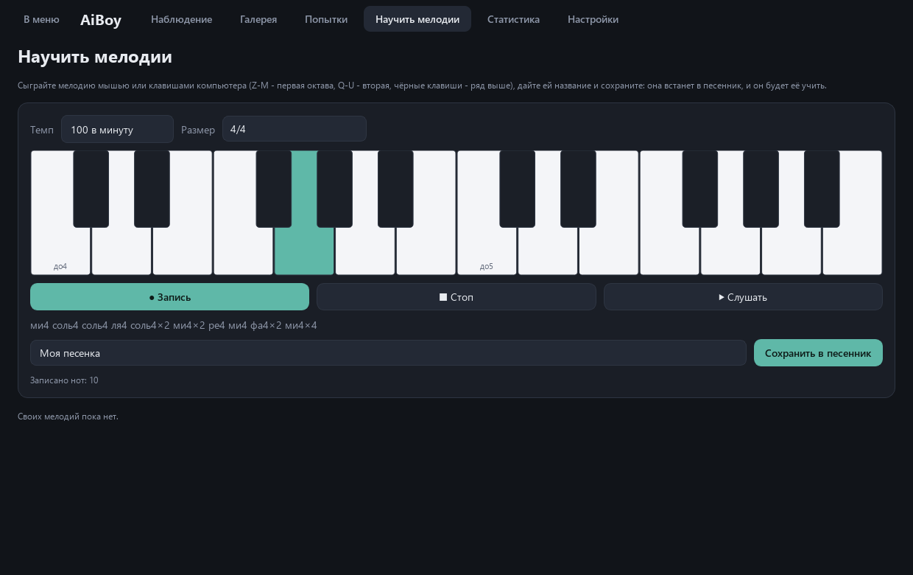
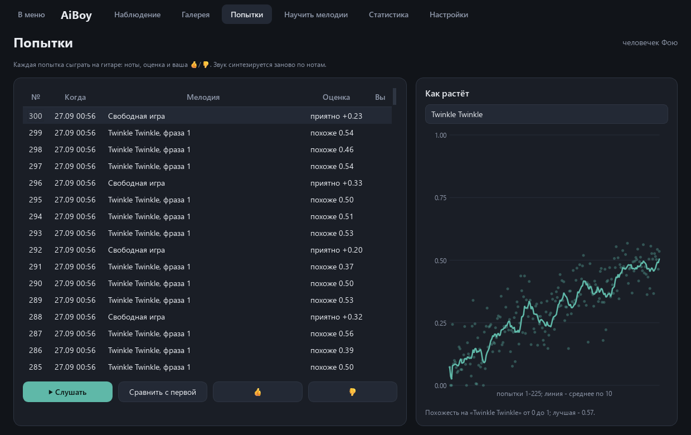
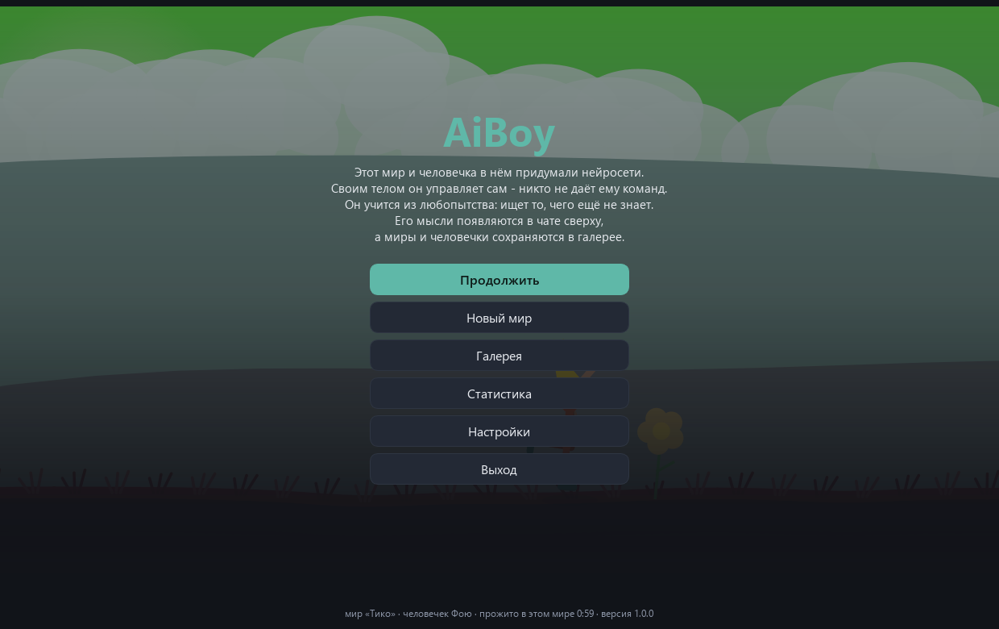

# AiBoy

**A living aquarium run by neural networks. One network invents a 2D world, another invents a little person, and then that person lives in the world: walks, jumps, waves his arms, goes up to trees and mushrooms, says things in a chat and, when the world gets boring, sits down and teaches himself the guitar. You just watch and listen.**

[Download for Windows](https://github.com/ALEXalesha/AiBoy/releases/latest) &nbsp;·&nbsp; [Русская версия этого файла](README.ru.md)

> **The interface and the little person's speech are in Russian**, and so is the long write-up - [README.ru.md](README.ru.md), which this file summarises. "Наблюдение / Галерея / Статистика / Настройки" are the Watch, Gallery, Statistics and Settings tabs; "Что видит" is the "what he sees" overlay.

The rule of the project: everything AiBoy does comes out of its own neural networks - terrain, sky and ground colours, mountains, clouds, trees, stones and crystals, the person himself, his movements and his phrases. The code only draws, moves the physics and trains. A template speech "teacher" exists only for training at build time; a test checks the sources to make sure the game never imports it. No PyTorch: layers, backpropagation, recurrent nets and Adam are numpy (`nn/`), and every gradient is checked against a numerical one. He has no voice: the owner decided the game is better without it. Since 1.1.0 only toys make sound, namely the guitar he learns to play on his own.

## Four networks

| Network | What it does | How it learned |
|---|---|---|
| **World** | from a seed: terrain, palette, mountains, clouds, entities (kind, colour, size), the world's name | CPPN with 1,637 weights; selected by evolution for "interestingness", no gradient |
| **Body** | from a seed: proportions, colours, hair style, name; the skeleton is always human, 15 points | the most varied of 300 random generators |
| **Brain** | 30 times a second: targets for 10 joints, which way to go, jump, "say" | starter weights from an evolution strategy at build time, then learns online from curiosity |
| **Speech** | a phrase for the chat from the brain's state | character-level GRU, 121,001 weights, trained on teacher phrases |

**World.** Side view; the world is a seamless ring. A reachability graph (`world/reach.py`) encodes what the body can actually do, measured on the physics: walk up slopes to 0.5 m per metre, jump 0.8 m up and 1 m ahead. A trap is a place from which the rest of the world cannot be reached. The first build judged steps against 0.45 m per 0.5 m, a slope the legs barely manage, so the person got stuck in ravines. Now, on 60 unseen seeds, 89 % of steps are walkable (81 % in the first build, 42 % for a random network), and no world has a trap. As a safeguard, the generator lowers the terrain by 15 % at a time if a trap ever appears; that was needed in 2 of the 60 worlds.

**Walking is not coded.** A foot on the ground does not slip; swinging the standing leg back moves the pelvis. The "go left/right" output only turns him around, and only when the wish lasts 0.3 s.

**Why he kept flipping and twitching.** Measured: 577 turns a minute, and joints reversing direction in 15 % of frames. He had found a hole in the physics: turning around re-planted the feet mirrored, so turning back and forth while pushing moved him faster than steps did. Now the feet stay put when he turns, turns need a sustained wish and a 0.6 s pause, joint commands are smoothed, in-game exploration noise is 0.35 of the training noise, and jerky actions cost reward. Now, measured in 10 unseen worlds for a minute each, as in the game: 0.6 turns a minute, joints reversing in 6.7 % of frames, 90 m from the start per minute, and out of the deepest hollow within 30 s in 10 worlds of 10.

**Curiosity instead of a task.** A predictor guesses what he will *see* one step later; its error, divided by a slow running mean, is the reward. Standing still gets boring. A "pulse" (sine and cosine of the body's clock) is part of the input, a rhythm a gait can use. Twelve minutes of the in-game actor-critic alone left him shuffling on the spot, so the starter actor weights come from an evolution strategy (`train/es.py`). Episodes are scored by how much new ground he saw and whether he climbed out of the deepest hollow, minus turns, twitching, falls and jumps. The chosen compromise still jumps 21 times a minute, more often than I would like; the calmest variant (a jump costing 2 m) did not jump at all but never got out of a hollow. Numbers are in `models/brain.json`. In the game everything keeps learning, the actor at 0.3 of the training step.

**What he sees.** Toggle with V, on by default. Rays to the 11 terrain points the brain receives, brightness = the predictor's error there, rings around the entities in his input, an arrow of the last second's intent, and a plain-words summary. It is built from the same observation vector the brain got, and a test compares the numbers.

**Speech.** Its input is a readable 27-number summary, not the brain's hidden vector (that drifts while the brain learns). On 600 unseen states, 99.5 % of phrases use only the teacher's words, 140 distinct phrases.

## The guitar (1.1.0)

The owner is learning the guitar himself and wanted the little person to learn too, and to be able to hear him getting better.

**When he plays.** A guitar lies in the world 1.5 m from where he appears. He picks it up on his way, carries it on his back and takes it into new worlds. He sits down to play when the world has become more boring than music, not on a timer. The world's interest is a slow average of his predictor's error. Measured on different bodies, it is 0.0023-0.0031 while walking and falls to 0.0011 after 30 s of standing and 0.0004 after a minute. A setting shifts the threshold (rarely / sometimes / often). He plays at least 3 attempts in a row and spends at least 20 s in the world between sessions.

**Sound.** The strings are synthesised in numpy with Karplus-Strong, using a fractional delay in the loop, and have a guitar body. The pitch is within 0.01 cent on all 6 strings and 13 frets; the measurement itself reads a string detuned by 0.3 % as 5.19 cents, which is correct. The decay is clean, and the peak after the limiter stays at 0.95 or below. Output goes through QtMultimedia on the Windows backend, without ffmpeg. At volume 0 the audio device is never opened.

**The musician** is his own GRU (96 hidden). Every eighth note it decides whether to strike, where on the neck (one head over 78 string-and-fret places), how hard and whether to mute. The reward is A + 0.5·B + 2·C:

- **A** is how close the take is to the tune: a note-by-note alignment that penalises wrong pitches and time shifts.
- **B** is how pleasant it sounds: consonance, a steady rhythm, novelty against his last 8 phrases, and penalties for silence and mush.
- **C** is your 👍/👎. Without a rating, a small taste model guesses it, but the guess only counts once the model has earned trust: it must first guess 5 of your ratings, and after that it counts more with the number of ratings and its accuracy.

The trust rule came from a measurement: eight random ratings in 300 attempts had driven the similarity to the tune down to zero. A rating is also clipped to 5 reward spreads, so that one rating does not drown out the similarity signal for the next 20 attempts. Without ratings the clip changes nothing.

**Songbook.** Ten public-domain tunes, each split into 4-bar phrases, plus your own from the «Научить мелодии» (teach a tune) screen: play it with the mouse or the Z-M / Q-U keys, name it, and he learns it first. Every fourth attempt is free play. «Кузнечик» ("The Grasshopper") from the task is not included, because its music (Shainsky, 1972) is not in the public domain, so the measurements use «Чижик-пыжик».

**How fast he learns.** The first phrase of «Чижик-пыжик» (14 notes), a musician from scratch with no ratings. Median similarity A per 100-attempt window, seeds 0-2:

| Attempts | 1-100 | 201-300 | 401-500 | 901-1000 |
|---|---|---|---|---|
| similarity A | 0.13-0.22 | 0.40-0.51 | 0.63-0.73 | 0.72-0.83 |

One attempt is 8.7 s of playing. The difference becomes audible after about 100 attempts (about 15 minutes), and by attempt 500 (about 75 minutes) the phrase is recognisable. With seed 1 it was learned (A = 0.85) at attempt 1048.

Listen to the samples below. Each file plays the attempt first and then, after a second, the tune played exactly, for comparison:

- [`docs/audio/chizhik-01-first.wav`](docs/audio/chizhik-01-first.wav) - the first attempt, A = 0.14
- [`docs/audio/chizhik-02-after-300.wav`](docs/audio/chizhik-02-after-300.wav) - attempt 300, A = 0.55
- [`docs/audio/chizhik-03-learned.wav`](docs/audio/chizhik-03-learned.wav) - attempt 1048, learned, A = 0.85

**Modes.** In «Музыкант» (musician mode) the chosen note sounds and the hands only show it. In «Руками» (by hand) a note sounds only if his hands actually reach the fret and the string. The hands learn from their own experience: they hit 5 % of notes over the first 100 attempts and 41 % by attempt 600, against a geometric ceiling of 74 %.

**While he plays** life runs at x1 so every attempt can be heard; a setting keeps x2-x8, and then he plays silently. The Watch screen shows the neck with his fingers, the notes against the tune, and 👍/👎. The chat shows his music phrases; the speech network was retrained for them.

**«Попытки»** (attempts) lists every attempt with «Слушать» (listen), «Сравнить с первой» (compare with the first attempt at the same tune), 👍/👎 and a chart of how the similarity grows.

## Screens

The game starts on a menu with a short explanation, and the current world stays frozen behind it: life pauses while the menu is open. Then Watch (world, chat on top, panel with curiosity chart, pause, speed x1/x2/x4/x8), Gallery, «Попытки» (attempts), «Научить мелодии» (teach a tune), Statistics and Settings (including volume and the guitar mode). Esc returns to the menu.

## Running it

Windows builds - an installer and a portable zip with Python, numpy and Qt inside - are on the [releases page](https://github.com/ALEXalesha/AiBoy/releases/latest).

From source (Python 3.11+): `pip install -r requirements.txt`, then `python main.py`. Headless self-check: `python main.py --selftest result.txt`. Besides living 300 steps and speaking, it checks that a string sounds at its pitch and that one guitar attempt is played, scored and saved. Retrain: `python -m train.world`, `train.body`, `train.speech`, `train.brain`. Build: `python build.py` (needs PyInstaller, Pillow and NSIS). Screenshots: `python tools\make_previews.py`; sound samples: `python tools\make_audio.py`.

## Tests

`python -m pytest` - 334 tests, about four minutes (208 in 1.0.0). They cover gradients, world seeds, the seamless ring and the no-trap law, body limits, physics (the stance leg moves the body, turning on the spot goes nowhere, smooth joints), the brain, speech, the trained models' behaviour (calm, still walking, climbs out of hollows), "no voice" (only the guitar uses QtMultimedia), the guitar, and the whole window driven without a screen. A mutation check broke the code on purpose 20 times (8 in the first build, 12 for the owner's fixes); four of the new breaks first survived, the tests were strengthened, and now every one turns them red. The guitar added 21 more deliberate breaks (a detuned string, no limiter, free extra notes, no silence penalty, a taste blind to similarity, a journal losing its first attempts, mood and hands rules, x8 while playing, the walking brain stepping while he plays, trusting the taste blindly, a self-check that does not save, a guitar that is not drawn): three survived at first, the tests were extended, and all 21 are caught now. The guitar tests include a learning law: over 200 attempts the median similarity of the last 20 beats the first 20 by at least 0.2.

## Licence

MIT, see [LICENSE](LICENSE).
