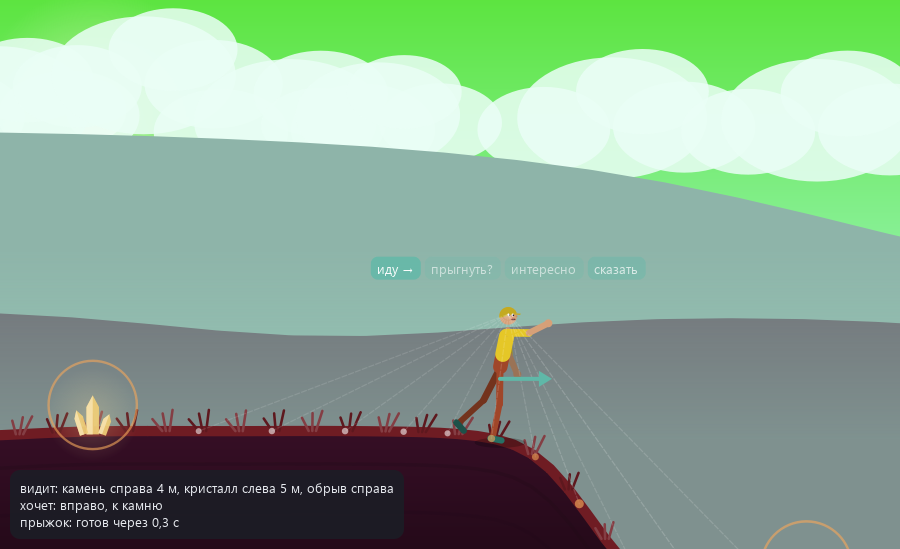
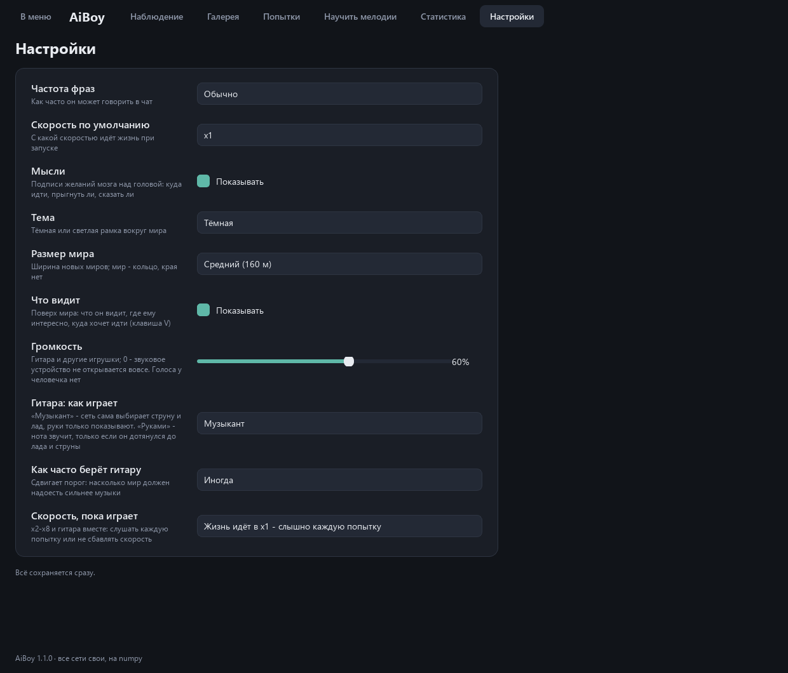

<div align="center">

# AiBoy

**Живой аквариум с нейросетью. Сеть сама придумывает двумерный мир и человечка, а потом этот человечек живёт в своём мире: ходит, прыгает, машет руками, подходит к деревьям и грибам, говорит что-то в чат, а когда мир надоест - садится и учится играть на гитаре. Вы только смотрите и слушаете.**

[Скачать для Windows](https://github.com/ALEXalesha/AiBoy/releases/latest) &nbsp;·&nbsp; [English version of this file](README.md)

[](https://github.com/ALEXalesha/AiBoy/actions/workflows/ci.yml)
[](https://github.com/ALEXalesha/AiBoy/releases/latest)
[](LICENSE)


</div>

Правило проекта, как у нейро-змейки: всё, что делает AiBoy, выдают его собственные нейросети. Рельеф, цвета неба и земли, горы, облака, деревья, камни и кристаллы, сам человечек, его движения и фразы. Код только рисует, двигает физику и учит. Шаблонный «учитель» речи есть, но только при обучении во время сборки, в игру он не попадает, и тест это проверяет по исходникам.

Никакого PyTorch: слои, обратное распространение, рекуррентные сети и Adam написаны на numpy (папка `nn/`), каждый градиент в тестах сверяется с численным.

Голоса нет: в первой сборке человечек тихо напевал, но владелец решил, что лучше без этого, и голос убран целиком. С версии 1.1.0 звук есть только у игрушек - у гитары, на которой человечек учится играть сам (ниже).

## Четыре сети (и гитара)

| Сеть | Что делает | Устройство | Как училась |
|---|---|---|---|
| **Мир** (`world/`) | по номеру-зерну: рельеф, палитра, горы, облака, сущности и их вид, цвет, размер, имя мира | CPPN, 1 637 весов: вход - координата гармониками и зерно, в слоях sin, гаусс, tanh | веса отобраны эволюцией на интересность, градиента нет |
| **Тело** (`body/`) | по зерну: пропорции, толщины, цвета кожи, волос и одежды, причёска, имя | маленький генератор, 24 выхода | из 300 случайных генераторов взят самый разнообразный |
| **Мозг** (`brain/`) | 30 раз в секунду: цели 10 суставов, куда идти, прыжок, «сказать» | рекуррентный слой 48 → 64, головы, критик, предсказатель | стартовые веса - эволюционная стратегия при сборке, дальше учится на ходу любопытством |
| **Речь** (`speech/`) | фраза в чат по состоянию мозга | посимвольная GRU, 160 скрытых, 121 001 вес | при сборке, на фразах учителя |
| **Музыкант** (`music/`) | на каждую восьмую: бить ли, место на грифе, сила, глушить ли | GRU 96, четыре головы и прямой вход «нота сейчас» | с нуля, в игре - у каждого человечка свой |
| **Вкус** (`music/taste.py`) | угадывает вашу 👍/👎 по признакам попытки | логистическая, 12 признаков | на ваших оценках |
| **Руки** (`brain/reach.py`) | куда вести руки к ладу и струне (режим «Руками») | две маленькие сети, по одной на руку | на своём опыте: «куда попала кисть - какая была команда» |

### Мир

Вид сбоку, как в платформере. Мир - кольцо: на вход сети подаются синусы и косинусы координаты с целым числом периодов на ширину мира (волны 80, 40, 24, 16 и 10 м), поэтому правый край без шва переходит в левый и стены на краю нет. Второй вход - зерно из 8 чисел: одно зерно - всегда один и тот же мир, разные зёрна - разные миры.

Сеть выдаёт для каждой точки высоту, оттенок земли, траву, плотность сущностей, вид сущности (дерево, куст, камень, цветок, гриб, кристалл), её цвет и размер, силуэты дальних и средних гор, облака. Отдельная маленькая часть той же сети по зерну выбирает палитру неба и земли, день или ночь, место солнца, облачность и слоги имени. Сущности стоят в вершинах плотности: генератора случайных чисел в мире нет вообще.

Веса сети мира не учатся градиентом. Их отбирает эволюция: 48 геномов, в каждом поколении шесть новых зёрен, чтобы геном был хорош для любого мира, а не для шести знакомых. Мерило - «интересность»:

| Часть | Что меряет |
|---|---|
| рельеф | стандартное отклонение высот, лучше всего 0.8-3 м |
| проходимость (вес 2) | доля шагов по 0.5 м с подъёмом, который тело берёт шагом (до 0.25 м), и доля мира, откуда можно попасть везде; стены выше 1 м на 0.5 м - штраф |
| контраст | небо у горизонта и земля различаются по яркости |
| сущности | от 10 до 28 на 100 м, хотя бы 4 вида, заметны на фоне земли |

Плюс разнообразие миров разных зёрен и доля ночных миров около четверти.

**Закон мира: ям-ловушек нет.** В первой сборке человечек застревал в оврагах - сидел на дне и упирался в склон. Сначала замер: что тело может на самом деле. Заученная походка с высоко поднятой ногой уверенно берёт склон 0.5 м на метр, на 0.9-1.1 ползёт еле-еле, на 1.5 застревает; прыжок поднимает таз на 0.91 м. А мир первой сборки считал ступенькой 0.45 м на 0.5 м - то есть уклон 0.9, на котором ноги уже почти не идут. Выбраться из таких впадин можно было только прыжками.

Теперь `world/reach.py` строит граф «отсюда можно попасть туда»: шагом - по уклону до 0.5, прыжком - на 0.8 м вверх и на 1 м вперёд, вниз - всегда. Ловушка - точка, откуда не попасть во весь мир. Эволюция продолжена с прошлого генома с новым мерилом (со случайного старта оно не давало сигнала: 300 поколений - ни одного проходимого мира), 200 поколений, 6 минут. И защита в генераторе: если ловушка всё же нашлась, рельеф той же формы делается ниже на 15 % за раз. Проверка на 60 новых зёрнах:

| | Случайная сеть | Первая сборка | Сейчас |
|---|---|---|---|
| интересность | 0.53 | - | **0.92** |
| шагов, которые тело берёт шагом | 42 % | 81 % | **89 %**, худший мир 80 % |
| миров с ловушками | 60 из 60 | 0 из 30 (только прыжками) | **0 из 60** |
| стен на 100 м | 25.6 | 0 | 0 |
| сущностей на 100 м | - | 19.8 | 18.0 |
| ночных миров | - | 15 % | 20 % |

Защита понадобилась в 2 мирах из 60, по одному разу. Тест проверяет закон на 60 других зёрнах.


### Человечек

Скелет всегда человеческий: 15 точек (голова, шея, таз, плечи, локти, кисти, бёдра, колени, стопы). Генератор тела выбирает только размеры в разумных пределах - голова, туловище, руки и ноги из двух звеньев, толщины, - а ещё цвет кожи, волос, рубашки, штанов и обуви, причёску (коротко, ёжик, длинные, кепка), размер глаз, румянец и имя. Левая и правая половины берут одни и те же числа, поэтому человечек симметричный по устройству. Новый мир или человечек не повторяет имя последних 12 миров галереи: имя по-прежнему выдаёт сеть, код только перебирает зерно.

### Физика и как он ходит

Ходьба в коде не написана. Мозг задаёт только цели суставов: наклон корпуса, шея, плечи, локти, бёдра, колени. Команда мозга сначала сама сглаживается (инерция «мотора», 0.1 с), потом тянет сустав (за 0.12 с на две трети пути, не быстрее 7 рад/с): сустав трогается и останавливается плавно.

Стопа, стоящая на земле, не скользит. Если мозг отводит опорную ногу назад, едет таз: это и есть толчок ногой об землю, другого способа сдвинуться у человечка нет. Вес на той стопе, что ниже. Нет опоры - полёт с гравитацией. Выход «прыжок» толкает вверх и чуть вперёд, по взгляду, - не чаще раза в 2 секунды. Подъём круче 2.5 м на метр - стена. Приземлился быстрее 8.5 м/с - падает, полторы секунды лежит и встаёт.

«Желание идти влево или вправо» только разворачивает человечка, и только если держится 0.3 секунды; разворот - не чаще раза в 0.6 секунды, и стопы при нём остаются там, где стояли.

### Почему он всё время разворачивался и дёргался

Владелец спросил: «почему он всё время туда-сюда поворачивается, что с ним?» Замер на 6 мирах по минуте, как в игре: **577 разворотов в минуту** - почти десять в секунду - и суставы, которые в 15 % кадров меняли направление движения.

По-простому: человечек нашёл дыру в физике и ходил ею. При развороте стопы переставлялись зеркально вместе со взглядом, и «развернулся - оттолкнулся - развернулся» двигало его вперёд быстрее, чем шаги. Мозг учится на том, что работает, - он и дёргался, потому что именно дёрганье его везло. Без дыры тот же мозг сдвигался за минуту на 7.7 м вместо 67.

Что исправлено:

- стопы при развороте остаются на месте (бёдра зеркалятся), разворот - только по желанию, которое держится 0.3 с, и не чаще раза в 0.6 с;
- команда мозга сглаживается до того, как тянуть сустав;
- в игре шум исследования в 0.35 от учебного, шаг обучения - в 0.3;
- в награде есть цена рывка: смена действия от шага к шагу стоит очков.

Замер в условиях игры - мозг учится на ходу, как в окне; «первая сборка» - 6 миров по минуте, «сейчас» - 10 других миров по минуте:

| | Первая сборка | Сейчас |
|---|---|---|
| разворотов в минуту | 577 | **0.6** |
| кадров, где сустав дёрнулся назад | 15 % | **6.7 %** |
| средний поворот сустава за кадр | 0.082 рад | **0.035 рад** |
| сдвиг с места за минуту | 67 м (разворотами) | **90 м** (ногами и прыжками) |
| путь со всеми шагами | 120 м | 142 м |
| прыжков в минуту | 26 | 21 |
| выбрался со дна самой глубокой впадины за 30 с | - | **10 из 10**, в среднем за 6 с |

Разворачиваться он по-прежнему умеет - тест проверяет, что устойчивое желание идти в другую сторону разворачивает его, - просто теперь это не выгодно само по себе.

### Мозг: любопытство вместо задания

Задания у человечка нет. В игре мозг учится на ходу, прямо пока вы смотрите, методом актёр-критик:

- **предсказатель** по тому, что человечек видит, и по своему действию угадывает, что изменится через шаг. Награда - его ошибка **в том, что человечек увидит**: рельеф вокруг и сущности. Своё тело предсказатель быстро выучивает, а новое место заранее не угадать - поэтому любопытство тянет туда, где он ещё не был. Ошибка делится на своё медленное среднее (около 30 секунд): стоит на одном месте - становится скучно, и выгоднее уйти;
- плюс 0.015 за каждый шаг на ногах, минус 1 за падение, минус цена рывка;
- **критик** оценивает состояние, **актёр** - гауссова политика углов с плавным шумом и Бернулли прыжка;
- рекуррентный слой учится с усечением на один шаг; на вход, кроме того, что он видит, приходит «пульс» - синус и косинус часов тела с периодом 0.9 с: сам ритм такой слой не выучит, а на ритм может опереться походка (какой она будет - решает обучение).

**Стартовый мозг.** Веса сохраняются между запусками, а чтобы при первом запуске человечек не был деревянным, в `models/brain.npz` лежит стартовый мозг. Сначала он учился так же, как в игре, - 12 минут актёра-критика. Это не сработало: без дыры в физике такой мозг топтался на месте (сдвиг 1-6 м за минуту). Градиент по одному шагу и одному образцу слишком шумный, чтобы за минуты выучить согласованную походку.

Поэтому веса актёра теперь от эволюционной стратегии (`train/es.py`). Цель та же - любопытство, только мерится грубо, по эпизоду в 12 секунд: сколько нового мира он увидел (размах пройденного), выбрался ли из самой глубокой впадины, минус развороты, дёрганье, падения и прыжки. Пары почти одинаковых мозгов сравниваются, и веса сдвигаются к тому, кто увидел больше. Как ходить, код не знает. Потом несколько минут онлайн учатся предсказатель и критик. Опыт с ценами:

| Как учился актёр | Цена прыжка | Минут | Сдвиг за минуту | Прыжков в минуту | Из впадин |
|---|---|---|---|---|---|
| онлайн актёр-критик, как в игре | - | 12 | 1-6 м на снимках | - | - |
| онлайн, с «пульсом» | - | 6 | 9 м | 10 | 1 из 10 |
| эволюция со случайных весов | 0 | 15 | 72 м | 28 | 8 из 10 |
| эволюция со случайных весов | 2 м | 15 | 18 м | 0 | 0 из 10 |
| **эволюция с варианта без цены прыжка** | **1 м** | **12 + 3 онлайн** | **90 м** | **21** | **10 из 10** |

Проверка везде одна: 10 новых миров по минуте в условиях игры и те же 10 миров - со дна самой глубокой впадины (в среднем 1.9 м глубиной) за 30 секунд.

Самый спокойный вариант - с ценой прыжка 2 м - не прыгал совсем и шёл 18 м за минуту, но не выбрался ни из одной впадины: подъём он шагом так и не осилил. Поэтому в `models/` компромисс: эволюция продолжена с варианта без цены прыжка, с ценой 1 м. Он выбирается из впадин всегда, но прыгает 21 раз в минуту - чаще, чем хотелось бы, и походка на кадрах ниже больше похожа на бег вприпрыжку, чем на шаг. Всего на стартовый мозг ушло 27 минут эволюции (15 + 12, это 63 часа прожитых эпизодов в последней части) и 3 минуты онлайн-обучения предсказателя и критика; числа - в `models/brain.json`. В игре учится всё, но шаг обучения актёра в 0.3 от учебного: так он меняется медленнее и не расшатывает походку за минуты.


### «Что видит»

Владелец хотел знать, что человечек видит и куда идёт. Кнопка «Что видит (V)», клавиша V и галочка в настройках, по умолчанию включено. Поверх мира:

- лучи от глаз к 11 точкам рельефа, которые мозг получает на вход, - от 4 м позади до 4 м впереди;
- яркость точки - ошибка предсказателя там: чем хуже он угадал, что там увидит, тем ему интереснее;
- кольца вокруг сущностей, которые попали в его наблюдение (не больше двух ближайших);
- стрелка - куда он хочет, в среднем за последнюю секунду;
- сводка словами: «видит: кристалл слева 3 м, камень справа 6 м, обрыв справа; хочет: вправо, к камню; прыжок: готов».

Всё берётся из того же вектора наблюдения, что получил мозг на последнем шаге, - тест сверяет числа. Рисуется раз в кадр, поэтому на x8 стоит столько же.



### Речь

Посимвольная GRU на русском: 33 буквы, пробел и пять знаков. Вход - не скрытый вектор мозга (он меняется, пока мозг учится, и речь, обученная при сборке, перестала бы его понимать), а понятная сводка из 27 чисел: холмы и ямы справа и слева, ровно ли вокруг, ближайшая сущность (вид, сторона, расстояние, цвет), желания идти и прыгать, любопытство, упал ли недавно, летит ли, ночь ли.

Учитель (`teacher/phrases.py`) по такой сводке пишет фразу из шаблонов: «вижу высокий холм справа», «тут что-то синее», «какое зелёное дерево», «попробую прыгнуть», «ой, больно», «интересно...» - с согласованием рода. Состояния для обучения собраны из настоящих прогонов мира. 46 800 пар «состояние - фраза», 14 эпох, 8 минут.

В игре учителя нет: фразу пишет только сеть, по одной букве, с температурой 0.75. Из трёх выборок берётся первая, которой не было среди восьми последних фраз, - чтобы чат не повторялся. Проверка на 600 новых состояниях: **99.5 %** фраз состоят только из слов учителя, 140 разных фраз, у разных состояний разные фразы в 97 % пар. Например, сеть на «упал»: «ничего, встаю», «ой!», «ой, больно», «земля твёрдая»; на «холм справа»: «справа гора», «холм справа!», «вижу высокий холм справа».

### Гитара

Владелец сам учится играть на гитаре и захотел, чтобы человечек учился тоже - и чтобы было слышно, как у него получается.

**Где гитара и когда он играет.** Гитара лежит в мире в полутора метрах от места появления. Проходя рядом, он её подбирает, носит за спиной и уносит с собой в новые миры. Играть он садится не по таймеру, а когда мир надоел сильнее музыки. Интерес к миру - медленное среднее ошибки его предсказателя. Замер у разных человечков: на ходу 0.0023-0.0031; если стоять на месте, через 30 секунд 0.0011, через минуту 0.0004. Интерес к музыке - новизна последних попыток и то, растёт ли награда. Порог задаёт настройка «Как часто берёт гитару»: редко, иногда, часто. Чтобы не дёргался, он сыграет не меньше 3 попыток подряд, а между сессиями проведёт в мире не меньше 20 секунд. Встаёт, когда мир снова интереснее.


**Звук.** Струна синтезируется на numpy, без готовых сэмплов. Это алгоритм Карплуса-Стронга: короткий шум бежит по петле задержки длиной в период ноты и затухает. Дробная часть периода берётся фильтром в петле, поэтому высота точная: на всех 6 струнах и 13 ладах отклонение меньше 0.01 цента. Сам замер проверен на струне, нарочно расстроенной на 0.3 %: он показывает 5.19 цента, как и должно быть. Дальше корпус (три резонанса: 98, 205 и 410 Гц), место щипка и сила удара: сильнее - громче и ярче. Приглушённая нота короткая и тихая. Фраза смешивается с ограничителем, и пик не выше 0.95. Все 468 звуков (струна x лад x сила x приглушённая) считаются заранее в фоне, за 4 секунды. Вывод - QtMultimedia через системный звук Windows, без ffmpeg. При громкости 0 звуковое устройство не открывается вовсе.

**Музыкант.** Своя рекуррентная сеть (GRU, 96 скрытых). На каждую восьмую долю она решает четыре вещи: бить ли по струне, место на грифе (одна голова на 78 мест: 6 струн x 13 ладов), силу (3 уровня) и глушить ли. На вход - её прошлое действие, доля такта и, если он учит мелодию, какая нота нужна сейчас и дальше. Одна нота звучит на гитаре в разных местах, и где её брать, сеть выбирает сама.

**Награда попытки** = A + 0.5·B + 2·C:

- **A** - похожесть на мелодию, от 0 до 1. Попытка выравнивается с мелодией нота к ноте, штраф - за другую высоту и за сдвиг во времени; точный повтор - 1;
- **B** - приятность, от -1 до 1: консонанс одновременных и соседних нот (таблица интервалов), ровность ритма, новизна против 8 последних своих фраз, штрафы за тишину и за «кашу»;
- **C** - ваша 👍/👎 (+1 или -1), самый большой вес. Без оценки - догадка вкуса, но с доверием: 0, пока вкус не угадал 5 ваших оценок, дальше растёт с числом оценок и с точностью.

Доверие появилось после замера. Восемь случайных оценок за 300 попыток роняли похожесть на мелодию до нуля: вкус по четырём оценкам «уверенно» угадывал ±1, и его догадка перевешивала всё остальное. Вторая поправка: оценка - это +2 к награде, десятки обычных разбросов. Её вклад обрезан до 5 разбросов, чтобы одна оценка не глушила сигнал похожести на следующие 20 попыток. На игре без оценок обрезка ничего не меняет: числа совпадают до сотых.

Обучение - REINFORCE по всей фразе, с базой для каждой мелодии и фразы.

**Песенник.** 10 простых мелодий в общественном достоянии: Twinkle Twinkle, Frère Jacques, «Ода к радости», Mary Had a Little Lamb, Jingle Bells, Happy Birthday, London Bridge, Au clair de la lune, «Чижик-пыжик», Old MacDonald. Каждая разбита на фразы по 4 такта. Он учит их по порядку, пока фраза не выучена (A не ниже 0.85), и каждая четвёртая попытка - свободная игра. «Кузнечика» в песеннике нет: музыка Владимира Шаинского (1972) не в общественном достоянии, поэтому все замеры сделаны на «Чижике-пыжике». Нет и «В лесу родилась ёлочка» (Бекман, 1905), хотя по срокам её уже можно: точную запись мелодии я уверенно не восстановил. По той же причине нет «Во поле берёза стояла».

**«Научить мелодии».** Своя мелодия: сыграть мышью по клавиатуре на экране или клавишами компьютера (Z-M - первая октава, Q-U - вторая, чёрные клавиши - ряд выше), выбрать темп и размер, послушать, назвать и сохранить. Ноты подгоняются к сетке восьмых. Своя мелодия идёт первой в очереди.


**Замер: как быстро он учит.** Первая фраза «Чижика-пыжика» (4 такта, 14 нот), музыкант с нуля, без оценок. Медиана похожести A за окно в 100 попыток, зёрна 0, 1, 2:

| Попытки | 1-100 | 201-300 | 401-500 | 901-1000 |
|---|---|---|---|---|
| похожесть A | 0.13-0.22 | 0.40-0.51 | 0.63-0.73 | 0.72-0.83 |

Попытка на темпе 110 - это 8.7 секунды игры. На слух разница заметна примерно через 100 попыток (A 0.14 → 0.37, около 15 минут, если он играет подряд), к 500-й (около 75 минут) фразу уже можно узнать. С зерном 1 фраза выучена (A = 0.85) на 1048-й попытке. Прежде чем взять эту схему, я пробовал другие (струна и лад двумя головами, разные шаги обучения): одни учились медленнее, другие срывались в тишину. Таблица - в плане, `docs/superpowers/plans/2026-09-26-aiboy-guitar.md`.

**Послушать.** В каждом файле сначала попытка, через секунду - сама мелодия точно по нотам, для сравнения:

- [`docs/audio/chizhik-01-first.wav`](docs/audio/chizhik-01-first.wav) - первая попытка, A = 0.14;
- [`docs/audio/chizhik-02-after-300.wav`](docs/audio/chizhik-02-after-300.wav) - 300-я, A = 0.55;
- [`docs/audio/chizhik-03-learned.wav`](docs/audio/chizhik-03-learned.wav) - 1048-я, выучена, A = 0.85.

Файлы делает `python tools\make_audio.py`: 16 бит, 22 кГц, моно, без перегруза.

**Режимы.** «Музыкант» (по умолчанию): сеть выбирает ноту, и та звучит, а руки только показывают - левая к ладу, правая к струне. «Руками»: нота звучит, только если он правда дотянулся. Не дотянулся правой рукой до струны - тишина, левой до лада - глухой звук. В награду идут только прозвучавшие ноты. Руки учатся на своём опыте («куда попала кисть - какая была команда»). Замер на человечке с зерном 7, Twinkle: 5 % попаданий за первые 100 попыток, 26 % к 300-й, 41 % к 600-й, промах в среднем 2.6 см. Потолок - точное прицеливание геометрией, 74 %: на восьмых рука не всегда успевает. Первый вариант учил руки по моторной награде (REINFORCE) и больше 4 % не набрал.

**Пока он играет**, жизнь идёт в x1, чтобы было слышно каждую попытку. Настройка «Скорость, пока играет» может оставить x2-x8, и тогда попытки идут без звука. Над миром - гриф: где пальцы (кружок на ладу; зелёный - нота прозвучала, красный - мимо), строка нот (серые рамки - мелодия, зелёные полоски - что он сыграл), название мелодии и кнопки 👍/👎. Оценку можно поставить и во время попытки, и после неё: она войдёт в награду и научит вкус. В чате - его фразы про музыку: «учу мелодию», «получилось!», «не выходит...». Для этого речь переобучена на состояния с гитарой; на новых состояниях она говорит словами учителя в 100 % фраз.

**«Попытки».** Журнал человечка: номер, время, мелодия и фраза, оценка, ваша 👍/👎. «Слушать» - попытка звучит заново по нотам. «Сравнить с первой» - сначала первая попытка этой мелодии, потом выбранная. Справа график: как росла похожесть на выбранную мелодию, а в свободной игре - приятность. В журнале не больше 2000 попыток: сверх этого остаются первые 20, каждая десятая и последние 200, чтобы было видно, с чего он начинал.


## Окно

**Меню** - с него программа начинается. Название, пять строк о том, что это, большие кнопки: «Играть» (или «Продолжить» и «Новый мир», если мир уже есть), «Галерея», «Статистика», «Настройки», «Выход». За меню - текущий мир с человечком, он растворяется к низу в цвете темы. Пока открыто меню, жизнь стоит. Esc и «В меню» из любого экрана - обратно.

**Наблюдение.** Мир и человечек, камера плавно идёт за ним. Сверху чат его фраз, как в мессенджере: текст и время жизни. Над головой - пузырь с последней фразой, «мысли» (куда идти, прыгнуть ли, интересно ли, хочется ли сказать) и «что видит». Справа - имя мира, время жизни, путь, число фраз, прыжков и падений, график любопытства, пауза, «Что видит (V)», скорость x1, x2, x4, x8 (последняя выбранная запоминается), «Новый мир» и «Новый человечек».


На x8 жизнь считается пачками по шагу физики, но на кадр - не дольше 12 мс, чтобы окно успевало рисовать; недосчитанное переходит в следующие кадры.

**Галерея** пополняется сама: каждый новый мир с человечком. Миниатюры рисуются заново по зёрнам, хранятся только номера и итоги жизни. «Открыть» - прожить в этом мире снова, «Удалить» - с подтверждением, из галереи, без Корзины. Отступы - из одной шкалы в `game/theme.py`: поля карточки 16 px, между картинкой, названием, строкой итогов и кнопками - 10 px (владелец написал: «слишком близко элементы»; тест меряет зазоры по геометрии, и в самом маленьком окне тоже).


**Попытки** и **Научить мелодии** - см. «Гитара» выше.

**Статистика**: сколько миров, сколько прожито и пройдено, фраз, прыжков, попыток на гитаре; кривая обучения мозга (средняя награда любопытства по прожитому времени); гитара - время с ней, оценки, лучшая похожесть по каждой мелодии, как часто вкус угадывает ваши оценки; самые частые слова; самые интересные миры по той же мере, что у эволюции.


**Настройки**: частота фраз, скорость, мысли над головой, «что видит», тема (тёмная или светлая), размер мира (80, 160 или 320 м), громкость, как играет на гитаре («Музыкант» или «Руками»), как часто берёт гитару, скорость, пока играет. Сохраняются сразу.




Окно открывается там, где его закрыли, тем же правилом, что в других программах автора. Подписи с переносом строк нигде не ограничены по высоте, и тест проверяет, что текст влезает в самое маленькое окно даже шрифтом на 10 % крупнее: на настоящем экране текст чуть шире, чем без экрана.

## Данные

Настройки, статистика, галерея, веса мозга, место окна - в `%LOCALAPPDATA%\AiBoy` (`settings.json`, `stats.json`, `gallery.json`, `brain.npz`, `window.json`); гитара - в `guitar\<зерно человечка>` (`journal.json`, `musician.npz`, `hands.npz`): у каждого человечка свой музыкант и свой журнал, и новый мир с тем же человечком их не сбрасывает. Свои мелодии - в `songbook.json`. Если рядом с `AiBoy.exe` лежит `portable.txt` (он есть в portable-архиве), всё пишется в папку `saves` рядом с программой. Испорченный файл не мешает: вместо него берутся значения по умолчанию, вместо битого мозга - стартовый. Файлы первой сборки с громкостью и счётчиком звуков читаются: громкость снова в деле, лишние поля забываются.

## Запуск

### Готовая сборка для Windows

В разделе релизов два файла, оба ничего не требуют от системы - Python, numpy и Qt внутри:

- `AiBoy-1.1.0-portable.zip` (52 МБ): распаковать и запустить `AiBoy.exe`;
- `AiBoy-1.1.0-setup.exe` (37 МБ): установщик с ярлыками и деинсталлятором. Прав администратора не просит, ставится в профиль пользователя.

В 1.0.0, без звука, из сборки убрали QtMultimedia и ffmpeg: было 60 МБ архив, 43 МБ установщик, 147 МБ папка, стало 51, 36 и 125 МБ. Для гитары в 1.1.0 вернулись только Qt6Multimedia и системный звук Windows (`windowsmediaplugin`), ffmpeg по-прежнему нет: 52 МБ архив, 37 МБ установщик, 127 МБ папка.

### Из исходников

Нужны Python 3.11 или новее, numpy и PySide6:

```
pip install -r requirements.txt
python main.py
```

Самопроверка без экрана - окно создаётся в памяти: мир, человечек, 300 шагов жизни, фраза, струна ля звучит своей высотой (не дальше 5 центов, без перегруза), одна попытка на гитаре сыграна, посчитана и после перезагрузки журнала на месте; итог в файл. Собранный `AiBoy.exe` понимает тот же флаг, данные пользователя самопроверка не трогает:

```
python main.py --selftest итог.txt
```

Обучить заново (4 потока процессора):

```
python -m train.world      # эволюция мира, 6 минут
python -m train.body       # отбор генератора тела, секунды
python -m train.speech     # речь, 8 минут
python -m train.brain      # стартовый мозг: эволюционная стратегия и онлайн, около 15 минут
```

Собрать установщик и portable-архив (нужны PyInstaller, Pillow и NSIS): `python build.py`. Кадры для этого файла делает сама программа - окно без экрана, снимок через `widget.grab()`: `python tools\make_previews.py`; звук - `python tools\make_audio.py`; замер обучения мелодии - `python tools\measure_learning.py`.

## Тесты

```
python -m pytest
```

334 теста, около 4 минут (208 было в 1.0.0):

- слои: градиенты плотного слоя, tanh, сигмоиды, рекуррентного шага и GRU во времени сверяются с численными, сохранение и загрузка;
- мир: одно зерно - один мир, разные - разные, кольцо без шва, сущности стоят на земле, цвета и высоты в пределах, мерило интересности, граф «куда можно попасть»: глубокая яма с крутыми стенками - ловушка, мелкая или с пологой стороной - нет, предел подъёма шагом совпадает с физикой; обученная сеть: ни одной ловушки на 60 новых зёрнах;
- тело: пропорции в пределах (гипотезы по любым зёрнам), скелет связный, симметрия, зеркало;
- физика: стоит на земле, отвод опорной ноги двигает таз, без ног не сдвинуться, походка идёт туда, куда он смотрит, прыжок, стена, падение и подъём, разворот на месте не двигает, разворот не чаще паузы и только по устойчивому желанию, сустав трогается плавно и без перелёта, тысячи шагов со случайными целями без NaN;
- мозг: наблюдение глазами человечка, «пульс», сводка видит холм справа и яму слева, ошибка предсказателя падает, в игре шум меньше, рывок стоит очков, без NaN, «сказать» не учится; стартовый мозг: спокоен (развороты, дёрганье, скорость суставов ниже порогов), всё ещё ходит, выбирается из самой глубокой впадины в 90 % миров и чаще;
- речь: учитель согласует род и говорит только словами словаря, градиент всей сети; обученная сеть говорит словами учителя; **игра не импортирует учителя**;
- голоса нет: у мозга нет выхода «звук», QtMultimedia импортирует только `game/audio.py`, сборка кладёт Qt6Multimedia и системный звук Windows, но не ffmpeg, громкость 0 не открывает устройство, старые файлы со звуком читаются;
- гитара: каждая струна и лад звучат своей высотой (не дальше 5 центов), затухание без подъёмов, сила - громкость, фраза без перегруза; песенник и свои мелодии (запись с клавиатуры, сетка восьмых, битый файл); награда - точный повтор даёт 1, сдвиг, лишние и пропущенные ноты снижают похожесть, тишина и каша наказаны; градиент музыканта сверяется с численным, **закон обучения**: за 200 попыток медиана похожести последних 20 выше первых 20 не меньше чем на 0.2; вкус угадывает скрытое правило и похожесть, доверие к нему на случайных оценках - около 0, случайные оценки не роняют обучение; журнал и его прореживание; «мир или гитара»: садится, когда мир надоел, встаёт, когда надоела музыка, настройка «как часто»; «Руками»: промах не звучит, руки учатся попадать; окно: гриф, звук попытки, x1 во время игры, 👍/👎, «Попытки», гитара нарисована лежащей, за спиной и в руках, всё переживает перезапуск;
- окно без экрана: старт на меню, каждая кнопка на свой экран и обратно, Esc, жизнь в меню стоит, x8 считает в 8 раз больше и не тормозит кадр, скорость запоминается, «что видит» строится из наблюдения мозга, влезает в кадр и не закрывает чат, галерея с отступами и несжатыми картинками, имена не повторяются, битые файлы, мозг переживает закрытие окна, надписи влезают в самое маленькое окно;
- самопроверка (в том числе струна и попытка на гитаре) и сборка.

**Мутационная проверка.** Код ломался нарочно, по одной поломке за раз, и каждый раз гонялись все тесты:

Первая сборка - восемь поломок, все пойманы:

| Поломка | Упало тестов |
|---|---|
| GRU: в градиенте по прошлому состоянию потерян вклад ворот сброса | 2 |
| опорная стопа едет вместе с ногой, а не держит | 5 |
| учитель ставит прилагательное всегда в мужском роде («синий дерево») | 1 |
| галерея не сохраняется в файл | 4 |
| мир не кольцо: на краю шов | 1 |
| предсказатель не учится | 1 |
| голос громче единицы (голоса больше нет) | 6 |
| пауза не останавливает жизнь | 1 |

Правки владельца - ещё двенадцать. Четыре сначала выжили (перебор имён, «что видит» при взгляде влево, перестановка стоп при развороте, полный шум в игре): тесты на них проверяли слишком мягкий случай. Тесты усилены, теперь ловятся все:

| Поломка | Упало тестов |
|---|---|
| окно открывается не на меню | 5 |
| жизнь идёт и в меню | 1 |
| игра снова импортирует QtMultimedia | 2 |
| на x8 недосчитанное время теряется | 1 |
| тесные карточки галереи, как раньше (поля 10, зазоры 4) | 2 |
| имя нового мира не сверяется с последними | 2 |
| лучи «что видит» не глазами человечка | 1 |
| разворот снова переставляет стопы | 1 |
| разворот от мелькнувшего на пару кадров желания | 4 |
| команда суставов без сглаживания | 3 |
| в игре полный шум исследования | 1 |
| мир без защиты от ловушек | 1 |

Гитара (1.1.0) - двадцать одна поломка. Три сначала выжили: лишние ноты поверх мелодии не снижали похожесть, штраф за тишину выключен, вкус не видит похожесть на мелодию. Тесты добавлены, теперь ловятся все:

| Поломка | Упало тестов |
|---|---|
| струна без дробной задержки (фальшивит) | 5 |
| фраза без ограничителя пика | 1 |
| лишние ноты не штрафуются | 1 |
| тишина не штрафуется | 1 |
| вкус не видит похожесть на мелодию | 1 |
| журнал при прореживании теряет первые попытки | 1 |
| «первая по мелодии» для сравнения - на самом деле последняя | 1 |
| встаёт после первой же попытки | 1 |
| настройка «как часто» ни на что не влияет | 2 |
| в «Руками» звучит и мимо струны | 2 |
| свободной игры нет | 1 |
| во время игры x8 со звуком | 1 |
| во время игры мозг ходьбы шагает | 4 |
| догадка вкуса в награде без доверия | 1 |
| оценка владельца раздувает разброс (без обрезки) | 1 |

## Устройство

| Папка / файл | Что делает |
|---|---|
| `nn/` | слои на numpy: плотный, tanh, сигмоида, рекуррентный шаг, GRU, Adam, сохранение `.npz` |
| `world/` | CPPN мира, мир по зерну, интересность, `reach.py` - куда можно попасть, ловушки |
| `body/` | генератор человечка, скелет из 15 точек, физика |
| `brain/` | наблюдение, сводка состояния, мозг с любопытством |
| `speech/` | речь - GRU по буквам |
| `music/` | гитара: гриф, звук струны, песенник, награда, музыкант, вкус, журнал, настроение «мир или гитара», руки на грифе, попытка целиком (`session.py`) |
| `teacher/` | учитель речи - только для обучения |
| `train/` | обучение при сборке: мир, тело, речь, стартовый мозг (`es.py` - эволюционная стратегия) |
| `game/` | жизнь без окна (`life.py`), замеры поведения (`probe.py`), «что видит» (`perception.py`), окно Qt: меню, рисование мира, чат, графики, галерея, статистика, настройки, звук (`audio.py`), гриф (`guitar_panel.py`), «Попытки» (`attempts.py`), «Научить мелодии» (`keyboard.py`) |
| `models/` | обученные веса и паспорта с числами обучения и проверок |

## Стек

Python · NumPy · PySide6 (Qt 6) · PyInstaller · NSIS

## Лицензия

MIT, см. [LICENSE](LICENSE).
