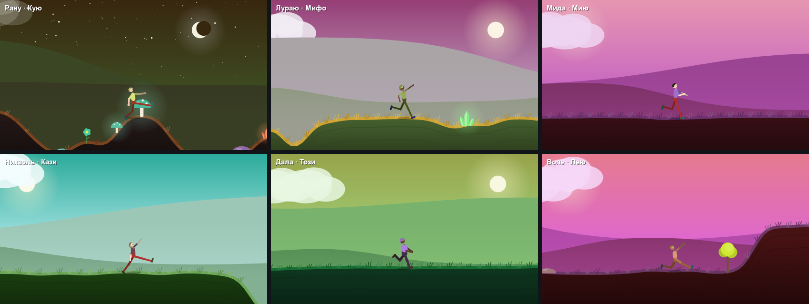
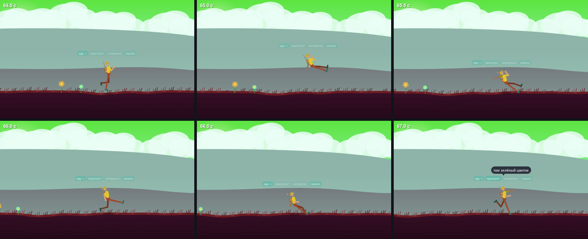
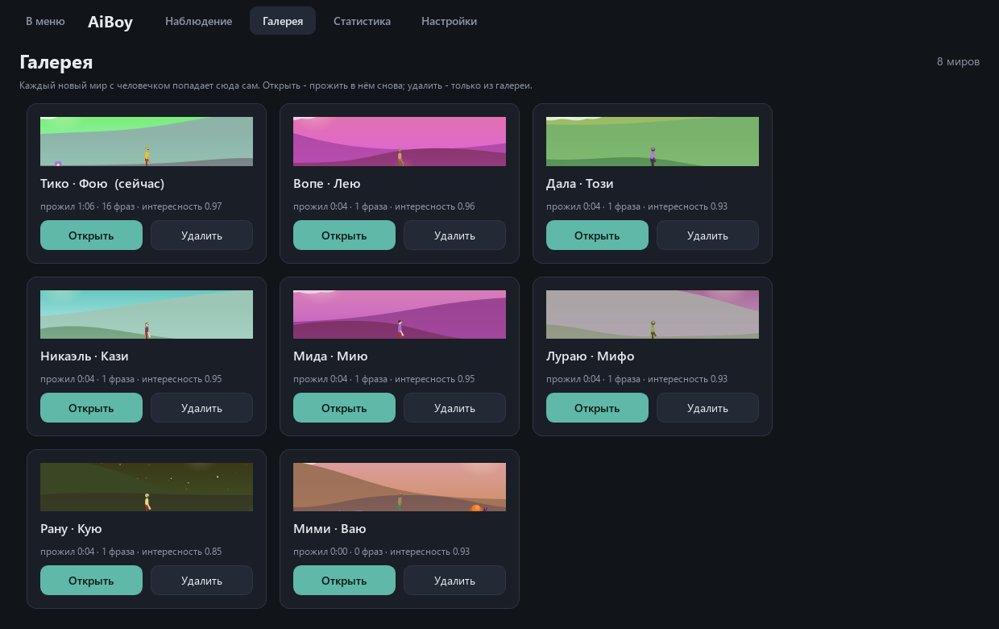
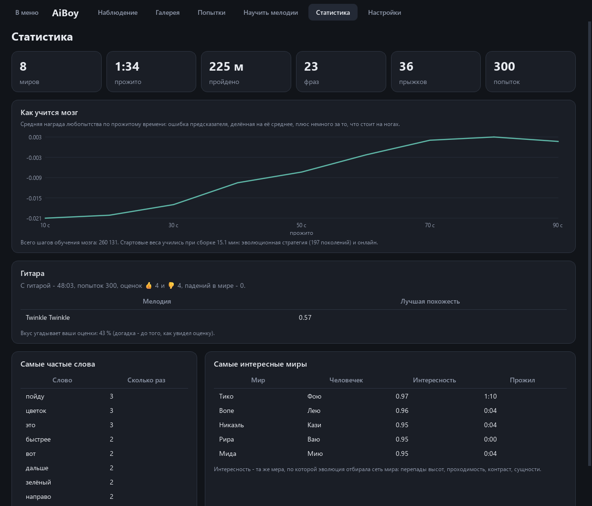
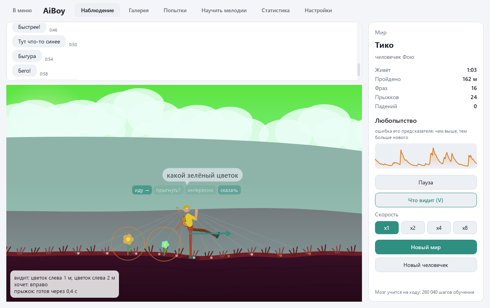

<div align="center">

# AiBoy

**Живой аквариум с нейросетью. Сеть сама придумывает двумерный мир и человечка, а потом этот человечек живёт в своём мире: ходит, прыгает, машет руками, подходит к деревьям и грибам, говорит что-то в чат и тихо напевает. Вы только смотрите.**

[Скачать для Windows](https://github.com/ALEXalesha/AiBoy/releases/latest) &nbsp;·&nbsp; [English version of this file](README.md)

[](https://github.com/ALEXalesha/AiBoy/actions/workflows/ci.yml)
[](https://github.com/ALEXalesha/AiBoy/releases/latest)
[](LICENSE)


</div>

Правило проекта, как у нейро-змейки: всё, что делает AiBoy, выдают его собственные нейросети. Рельеф, цвета неба и земли, горы, облака, деревья, камни и кристаллы, сам человечек, его движения, фразы и звуки. Код только рисует, двигает физику и учит. Шаблонные «учителя» есть, но только при обучении во время сборки, в игру они не попадают, и тест это проверяет по исходникам.

Никакого PyTorch: слои, обратное распространение, рекуррентные сети и Adam написаны на numpy (папка `nn/`), каждый градиент в тестах сверяется с численным.

## Пять сетей

| Сеть | Что делает | Устройство | Как училась |
|---|---|---|---|
| **Мир** (`world/`) | по номеру-зерну: рельеф, палитра, горы, облака, сущности и их вид, цвет, размер, имя мира | CPPN, 1 637 весов: вход - координата гармониками и зерно, в слоях sin, гаусс, tanh | веса отобраны эволюцией на интересность, градиента нет |
| **Тело** (`body/`) | по зерну: пропорции, толщины, цвета кожи, волос и одежды, причёска, имя | маленький генератор, 24 выхода | из 300 случайных генераторов взят самый разнообразный |
| **Мозг** (`brain/`) | 30 раз в секунду: цели 10 суставов, куда идти, прыжок, «сказать», «звук» | рекуррентный слой 46 → 64, головы, критик, предсказатель | учится на ходу, любопытством |
| **Речь** (`speech/`) | фраза в чат по состоянию мозга | посимвольная GRU, 160 скрытых, 121 001 вес | при сборке, на фразах учителя |
| **Голос** (`voice/`) | высота, мелодия, гласная, длина звука | плотная 27 → 24 → 7 и синтезатор на numpy | при сборке, на параметрах учителя |

### Мир

Вид сбоку, как в платформере. Мир - кольцо: на вход сети подаются синусы и косинусы координаты с целым числом периодов на ширину мира (волны 80, 40, 24, 16 и 10 м), поэтому правый край без шва переходит в левый и стены на краю нет. Второй вход - зерно из 8 чисел: одно зерно - всегда один и тот же мир, разные зёрна - разные миры.

Сеть выдаёт для каждой точки высоту, оттенок земли, траву, плотность сущностей, вид сущности (дерево, куст, камень, цветок, гриб, кристалл), её цвет и размер, силуэты дальних и средних гор, облака. Отдельная маленькая часть той же сети по зерну выбирает палитру неба и земли, день или ночь, место солнца, облачность и слоги имени. Сущности стоят в вершинах плотности: генератора случайных чисел в мире нет вообще.

Веса сети мира не учатся градиентом. Их отбирает эволюция: 48 геномов, 300 поколений, в каждом поколении шесть новых зёрен, чтобы геном был хорош для любого мира, а не для шести знакомых. Мерило - «интересность»:

| Часть | Что меряет |
|---|---|
| рельеф | стандартное отклонение высот, лучше всего 0.8-3 м |
| проходимость (вес 2) | доля шагов по 0.5 м с перепадом не выше 0.45 м, и штраф за стены выше 1 м на 0.5 м - их не перепрыгнуть |
| контраст | небо у горизонта и земля различаются по яркости |
| сущности | от 10 до 28 на 100 м, хотя бы 4 вида, заметны на фоне земли |

Плюс разнообразие миров разных зёрен и доля ночных миров около четверти. Проверка на 60 новых зёрнах:

| | Случайная сеть | После эволюции |
|---|---|---|
| интересность | 0.54 | **0.98** |
| проходимость (доля шагов) | 54 % | **95 %**, худший мир 90 % |
| стен на 100 м | 25.6 | **0** |
| сущностей на 100 м | - | 19.8 |
| ночных миров | - | 15 % |

Первая версия сети видела ещё волну 6 м - и эволюция 300 поколений не нашла ни одного проходимого мира: 67 % проходимых шагов, 77 стен на 100 м. Волну убрал, высоту сглаживаю на полметра (это защита от зубцов, форма холмов своя), мерило проходимости сделал плавным - и эволюции появилось за что держаться. Эволюция идёт 6 минут.



### Человечек

Скелет всегда человеческий: 15 точек (голова, шея, таз, плечи, локти, кисти, бёдра, колени, стопы). Генератор тела выбирает только размеры в разумных пределах - голова, туловище, руки и ноги из двух звеньев, толщины, - а ещё цвет кожи, волос, рубашки, штанов и обуви, причёску (коротко, ёжик, длинные, кепка), размер глаз, румянец и имя. Левая и правая половины берут одни и те же числа, поэтому человечек симметричный по устройству.

### Физика и как он ходит

Ходьба в коде не написана. Мозг задаёт только цели суставов: наклон корпуса, шея, плечи, локти, бёдра, колени. Суставы тянутся к целям плавно (за 0.12 с на две трети пути, не быстрее 7 рад/с).

Стопа, стоящая на земле, не скользит. Если мозг отводит опорную ногу назад, едет таз: это и есть толчок ногой об землю, другого способа сдвинуться у человечка нет. Вес на той стопе, что ниже. Нет опоры - полёт с гравитацией. Резко разогнутая нога подбрасывает, выход «прыжок» толкает вверх и чуть вперёд, по взгляду, - не чаще раза в 2 секунды. Подъём круче 2.5 м на метр - стена. Приземлился быстрее 8.5 м/с - падает, полторы секунды лежит и встаёт.

«Желание идти влево или вправо» только разворачивает человечка. Идти само по себе оно не умеет.

### Мозг: любопытство вместо задания

Задания у человечка нет. Мозг учится на ходу, прямо пока вы смотрите, методом актёр-критик:

- **предсказатель** по тому, что человечек видит, и по своему действию угадывает, что изменится через шаг. Награда - его ошибка **в том, что человечек увидит**: рельеф вокруг и сущности. Своё тело предсказатель быстро выучивает, а новое место заранее не угадать - поэтому любопытство тянет туда, где он ещё не был. Ошибка делится на своё скользящее среднее, чтобы награда не угасала вместе с ней;
- плюс 0.015 за каждый шаг на ногах и минус 1 за падение;
- **критик** оценивает состояние, **актёр** - гауссова политика углов с плавным (коррелированным во времени) шумом и Бернулли прыжка;
- рекуррентный слой учится с усечением на один шаг: прошлое состояние для градиента - просто вход. Так обучение дешёвое: шаг мозга с обучением - меньше миллисекунды.

Веса мозга сохраняются между запусками. Чтобы при первом запуске человечек не был совсем деревянным, в `models/brain.npz` лежит стартовый мозг - итог того же онлайн-обучения при сборке: 360 миров по минуте жизни, 666 000 шагов мозга - это 6.2 часа жизни. Что изменилось на 10 новых мирах по минуте:

| | До обучения | Стартовый мозг |
|---|---|---|
| сдвиг с места за минуту, м | 3.0 | **62.1** |
| путь со всеми шагами туда и обратно, м | 35.9 | 127.1 |
| миров, где отошёл дальше 2 м | 6 из 10 | **10 из 10** |
| прыжков за 10 минут | 116 | 263 |
| падений | 0 | 0 |
| ошибка предсказателя | 0.116 | 0.013 |

Честно о том, как он выбран. За 12 минут прошло 579 миров. Каждые 40 миров снимок весов проверялся на пяти отдельных мирах (сдвиг с места за 30 секунд, без обучения), в `models/` взят лучший - после 360 миров. Между снимками поведение скачет сильно: на проверке то 3 м, то 39 м. Обучение на ходу нестационарное - награда любопытства меняется вместе с самим предсказателем, - и в игре мозг продолжает меняться: может разучиться ходить и выучиться снова.

Как выбиралась награда - тоже опытом. Проверка та же: 10 новых миров по минуте, сдвиг - среднее расстояние от места старта через минуту.

| Награда | За шаг на ногах | Прыжок не чаще | Минут обучения | Сдвиг, м | Прыжков |
|---|---|---|---|---|---|
| ошибка по всему наблюдению, и своё тело тоже | 0.01 (и в воздухе) | 0.5 с | 12 | 5.6 | 245 |
| ошибка по увиденному | 0.01 (и в воздухе) | 0.5 с | 5 | 8.7 | 288 |
| ошибка по увиденному | 0.03 | 1 с | 5 | 2.5 | 6 |
| ошибка по увиденному | 0.015 | 1 с | 12 | 23 | 491 |
| **ошибка по увиденному** | **0.015** | **2 с, ниже** | **12, лучший снимок** | **62** | **263** |

Предпоследний вариант выучил одно: скакать без остановки, раз в секунду. Это было живо, но непохоже на человека, поэтому прыжок стал реже и ниже. Последний вариант тоже прыгает часто - в среднем раз в 2.3 секунды, почти так часто, как позволяет пауза, - но между прыжками шагает ногами.



### Речь

Посимвольная GRU на русском: 33 буквы, пробел и пять знаков. Вход - не скрытый вектор мозга (он меняется, пока мозг учится, и речь, обученная при сборке, перестала бы его понимать), а понятная сводка из 27 чисел: холмы и ямы справа и слева, ровно ли вокруг, ближайшая сущность (вид, сторона, расстояние, цвет), желания идти и прыгать, любопытство, упал ли недавно, летит ли, ночь ли.

Учитель (`teacher/phrases.py`) по такой сводке пишет фразу из шаблонов: «вижу высокий холм справа», «тут что-то синее», «какое зелёное дерево», «попробую прыгнуть», «ой, больно», «интересно...» - с согласованием рода. Состояния для обучения собраны из настоящих прогонов мира. 46 800 пар «состояние - фраза», 14 эпох, 8 минут.

В игре учителя нет: фразу пишет только сеть, по одной букве, с температурой 0.75. Из трёх выборок берётся первая, которой не было среди восьми последних фраз, - чтобы чат не повторялся. Проверка на 600 новых состояниях: **99.5 %** фраз состоят только из слов учителя, 140 разных фраз, у разных состояний разные фразы в 97 % пар. Например, сеть на «упал»: «ничего, встаю», «ой!», «ой, больно», «земля твёрдая»; на «холм справа»: «справа гора», «холм справа!», «вижу высокий холм справа».

### Голос

Сеть 27 → 24 → 7 выдаёт параметры синтезатора: высоту, куда идёт мелодия, число нот, длину, гласную (у, о, а, э, и), дрожание, яркость. Синтезатор на numpy складывает гармоники с формантами гласных, ноты только из пентатоники (любые две звучат вместе без фальши), мягкое нарастание и затухание, громкость не выше 0.55. Учитель голоса задаёт характер: упал - низко и вниз, любопытно - вверх, рядом сущность - три ноты, прыжок - коротко и высоко. Ошибка сети на новых состояниях - 0.007. Звук - не чаще раза в 5, 9 или 16 секунд, смотря по частоте фраз.

## Окно

**Наблюдение** - главный экран. Мир и человечек, камера плавно идёт за ним. Сверху чат его фраз, как в мессенджере: текст и время жизни. Над головой - пузырь с последней фразой и, если включены «мысли», подписи желаний мозга: куда идти, прыгнуть ли, интересно ли, хочется ли сказать. Справа - имя мира, время жизни, путь, число фраз, звуков, прыжков и падений, график любопытства (ошибка предсказателя за последнюю минуту), пауза, скорость x1, x2, x4, «Новый мир» и «Новый человечек».

**Галерея** пополняется сама: каждый новый мир с человечком. Миниатюры рисуются заново по зёрнам, хранятся только номера и итоги жизни. «Открыть» - прожить в этом мире снова, «Удалить» - с подтверждением, из галереи, без Корзины.



**Статистика**: сколько миров, сколько прожито и пройдено, фраз, звуков, прыжков, падений; кривая обучения мозга (средняя награда любопытства по прожитому времени); самые частые слова; самые интересные миры по той же мере, что у эволюции.



**Настройки**: громкость, частота фраз, скорость по умолчанию, мысли над головой, тема (тёмная или светлая), размер мира (80, 160 или 320 м). Сохраняются сразу.



Окно открывается там, где его закрыли, тем же правилом, что в других программах автора: если монитор отключили или размер не влезает, окно всё равно появляется там, где его видно.

## Данные

Настройки, статистика, галерея, веса мозга, место окна - в `%LOCALAPPDATA%\AiBoy` (`settings.json`, `stats.json`, `gallery.json`, `brain.npz`, `window.json`, звуки в `sounds`). Если рядом с `AiBoy.exe` лежит `portable.txt` (он есть в portable-архиве), всё пишется в папку `saves` рядом с программой. Испорченный файл не мешает: вместо него берутся значения по умолчанию, вместо битого мозга - стартовый.

## Запуск

### Готовая сборка для Windows

В разделе релизов два файла, оба ничего не требуют от системы - Python, numpy и Qt внутри:

- `AiBoy-1.0.0-portable.zip` (60 МБ): распаковать и запустить `AiBoy.exe`;
- `AiBoy-1.0.0-setup.exe` (43 МБ): установщик с ярлыками и деинсталлятором. Прав администратора не просит, ставится в профиль пользователя.

### Из исходников

Нужны Python 3.11 или новее, numpy и PySide6:

```
pip install -r requirements.txt
python main.py
```

Самопроверка без экрана - окно создаётся в памяти: мир, человечек, 300 шагов жизни, фраза, звук, итог в файл. Собранный `AiBoy.exe` понимает тот же флаг, данные пользователя самопроверка не трогает:

```
python main.py --selftest итог.txt
```

Обучить заново (4 потока процессора):

```
python -m train.world      # эволюция мира, 6 минут
python -m train.body       # отбор генератора тела, секунды
python -m train.speech     # речь, 8 минут
python -m train.voice      # голос, 10 секунд
python -m train.brain      # стартовый мозг, 12 минут
```

Собрать установщик и portable-архив (нужны PyInstaller, Pillow и NSIS): `python build.py`. Кадры для этого файла делает сама программа - окно без экрана, снимок через `widget.grab()`: `python tools\make_previews.py`.

## Тесты

```
python -m pytest
```

161 тестов, около минуты:

- слои: градиенты плотного слоя, tanh, сигмоиды, рекуррентного шага и GRU во времени сверяются с численными, сохранение и загрузка;
- мир: одно зерно - один мир, разные - разные, кольцо без шва, сущности стоят на земле, цвета и высоты в пределах, мерило интересности; обученная сеть: проходимость на 30 новых зёрнах, интереснее случайной, миры разные;
- тело: пропорции в пределах (гипотезы по любым зёрнам), скелет связный, симметрия, зеркало;
- физика: стоит на земле, падает на землю, отвод опорной ноги двигает таз, без ног не сдвинуться, походка идёт туда, куда он смотрит, прыжок и приземление, стена держит, падение и подъём, тысячи шагов со случайными целями без NaN и без стоп под землёй;
- мозг: наблюдение глазами человечка, сводка видит холм справа и яму слева, ошибка предсказателя падает при обучении, человечек сдвигается в части миров, без NaN, «сказать» и «звук» не учатся, сохранение;
- речь: учитель согласует род и говорит только словами словаря, сеть учится на маленьком наборе, градиент всей сети; обученная сеть говорит словами учителя и по-разному в разных состояниях; **игра не импортирует учителя** - проверка по исходникам;
- голос: длина и громкость при любых параметрах, края без щелчков, ноты из пентатоники, падение звучит ниже любопытства;
- окно без экрана: каждый экран в обеих темах, чат пополняется, пауза и скорость, галерея открывает и удаляет мир (только с подтверждением), битые файлы, мозг переживает закрытие окна, переносимые надписи не обрезаются в самом маленьком окне даже шрифтом на 10 % крупнее;
- самопроверка и сборка.

**Мутационная проверка.** Код ломался нарочно, по одной поломке за раз, и каждый раз гонялись все тесты:

| Поломка | Упало тестов |
|---|---|
| GRU: в градиенте по прошлому состоянию потерян вклад ворот сброса | 2 |
| опорная стопа едет вместе с ногой, а не держит | 5 |
| учитель ставит прилагательное всегда в мужском роде («синий дерево») | 1 |
| галерея не сохраняется в файл | 4 |
| мир не кольцо: на краю шов | 1 |
| предсказатель не учится | 1 |
| голос громче единицы | 6 |
| пауза не останавливает жизнь | 1 |

Все восемь поломок пойманы.

## Устройство

| Папка / файл | Что делает |
|---|---|
| `nn/` | слои на numpy: плотный, tanh, сигмоида, рекуррентный шаг, GRU, Adam, сохранение `.npz` |
| `world/` | CPPN мира, мир по зерну, интересность |
| `body/` | генератор человечка, скелет из 15 точек, физика |
| `brain/` | наблюдение, сводка состояния, мозг с любопытством |
| `speech/`, `voice/` | речь (GRU по буквам), голос (сеть и синтезатор) |
| `teacher/` | учителя речи и голоса - только для обучения |
| `train/` | обучение при сборке: мир, тело, речь, голос, стартовый мозг |
| `game/` | жизнь без окна (`life.py`) и окно Qt: рисование мира, чат, графики, галерея, статистика, настройки, звук |
| `models/` | обученные веса и паспорта с числами обучения и проверок |

## Стек

Python · NumPy · PySide6 (Qt 6, QtMultimedia) · PyInstaller · NSIS

## Лицензия

MIT, см. [LICENSE](LICENSE).
